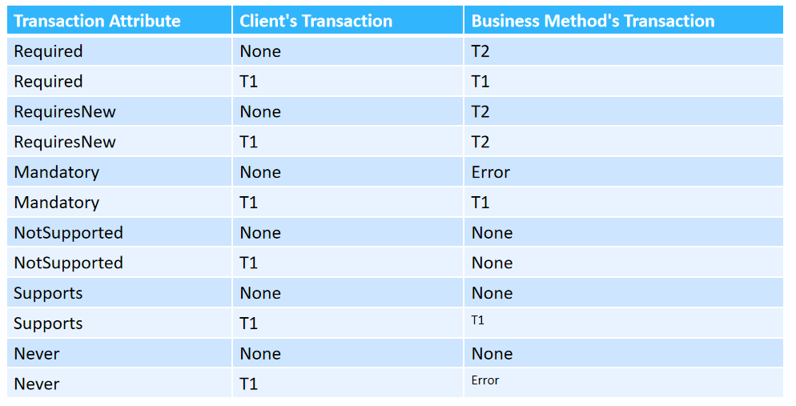

# 02-`Transaction`

- 定义：事务是一系列**必须一起成功(`A Commit`)或失败(`A Rollback`)**的操作。

- `Container-Managed Transaction`的几个类型：(注意最小粒度为**函数**)
  
  - `Required`:`Default`模式。含义为在一个函数被调用时，若声明为`Required`，则调用时已经存在一个事务则**直接加入该事务而不创建新的事务**，若不存在一个事务，则**创建一个新的事务并在其中运行**。
  
  - `RequiredNew`:含义为在一个函数被调用时，若声明为`RequiredNew`,则调用时无论**是否存在一个事务**，都**一定会创建一个新的进程**。
  
  - `Supports`:含义为在一个函数被调用时，若声明为`Supports`,则若不存在一个事务，则**直接在无事务状态下运行**，若存在一个事务，则**加入这个事务并在事务中执行函数**。
  
  - `NotSupported`:含义为在一个函数被调用时，若声明为`NotSupported`,则若存在事务则**会将现有事务挂起**，并在**无事务条件下**运行。
  
  - `Never`:含义为在一个函数被调用时，若存在事务，则直接**抛出异常**，若不存在事务，则在**无事务条件下运行**。
  
  - `Mandoatory`:与`Never`相反。
  
  - **理解02课件第12页的表格!**
  
    
  
- 当出现错误时若想进行`RollBack`,最好的方式为**抛出异常**。也可以使用`setRollbackOnly`(不常用)。

- `Spring`中使用`@Transactional(propagation=Propagation.REQUIRED/NOT_SUPPORTED/REQUIRES_NEW/MADATORY/NEVER/SUPPORTS)`来声明。(默认为`REQUIRED`)。(`propagation`：传播属性)(注意使用的`springframework`中的`Transactional`注解).

- 好好看`PPT`23-25页。

- `Isolation`做的不好时可能出现的问题：
  
  - `Dirty Read`:一个用户在读取时，另外一个用户正在尝试修改对应的数据，并且修改的数据对应的事务还未提交，则可能出现读取信息的用户获取的数据是一个事务的中间状态，从而使得获取的数据可能不准确，因为修改数据的事务是可能发生回滚的。一种解决方式为：对修改信息的事务上锁
  - `Nonrepeated Reads`:说的是一个用户在查询数据的过程中，其正在查询使用的数据被另外的用户**成功**的修改了，所以会出现再次读取数据变化的问题。解决方式为对于要访问的数据加**行锁**。但是这样并不能完全解决问题，因为可能出现别的用户不在修改数据，而是**添加新的数据**。
  - `Phantom Reads`(幻影读):即上一部分提到的添加了新数据的问题。解决方式为**对要访问的整张表上表锁**。
  
- 几种`Database Locks`：

  - `Read Lock`:做的事情是在一个**读取数据**的事务结束之前，任何事务(包括自己)都不能修改已经被读取的数据(但是可以读取)，所以避免了`Nonrepeated Reads`问题。
  - `Write Lock`:做的事情是在一个修改数据的事务结束前，其他事务不能修改对应的数据。**但是可以读**。但是这个锁**不能**避免其他事务和**这个事务本身**去进行`Dirty Reads`。
  - `Exclusive Write Lock`:做的事情是在一个**修改数据**的事务结束之前，其他事务不能**读取或者修改**对应的数据。即当前事务独占了对于数据的操作权限。这直接解决了`Dirty Read`。
  - `SnapShots`:**快照**做的事情是在事务开始**前**记录下此时的数据的状态，这样在一个事务运行时，其他事务只能获取到对应的快照，所以就不存在其他事务的修改对当前事务的影响。所以直接避免上述的所有三个问题。

- `Transaction Isolation Level`:

  - `Read Uncommited`:相当于什么没做，所以不会解决三个问题。适用于写操作很少的场景。
  - `Read Commited`:事务不可以**读取**未提交的事务的数据。但是可以修改。所以只解决了`Dirty Read`。
  - `Repeatable Read`:事务不可以**修改其他事务正在读取的数据**。所以解决了脏读和不可重复读的问题。相当于对于读取的那些数据行上了一个行锁。
  - `Serializable`:事务具有“`exclusive read and update privileges`”。解决了全部三个问题。但是会使得程序完全串行，性能最差。

- `Spring`中的注解声明方式：

  ```java
  @Transactional(isolation = Isolation.READ_UNCOMMITTED)     
  @Transactional(isolation = Isolation.READ_COMMITTED)      
  @Transactional(isolation = Isolation.REPEATABLE_READ)      
  @Transactional(isolation = Isolation.SERIALIZABLE)
  ```

- 多数据源之间数据同步更新主要步骤：(`2PC`)

  - `prepare`.即**`Transactional Manager`**向各个要更新的数据源发送请求，询问能否成功`commit`修改的内容。但是这里要注意，即使回复说都可以成功提交，其在真正提交时也可能会出错，这时候可能将需要**手动的**实现回滚。即老师上课讲的那个不同银行之间转账失败的例子。
  - `commit/rollback`.若所有数据源都回复说可以`commit`,则直接全部`commit`，只要有一个回复说不能`commit`或者有一个**无法回复**,则`Transaction Manager`则通知所有数据源都不更新/回滚。

- 要理解一个概念：分布式数据库并不是说每个数据库一定要位于不同的机器上面，也可以是同一台机器上面的多个不同的(同类型不同内容/不同类型)数据库。

- 支持事务的东西成为`Resource Manager`。

- `OR`映射<=>`offline operations`。

- `Concurrency Lock`:

  - 离线：指的是发生在服务器内存中的数据修改，但是还没有反映到数据库中，添加离线锁就是为了保证内存中数据与数据库中数据是一致的。

  - `Optimistic Offline Lock`:乐观离线锁。“乐观”指的是默认操作之间不会产生`confliction`,所以不会对操作进行加锁处理。虽然不需要加锁，但是乐观锁还是需要解决如何实现修改数据之后的同步问题。需要`validation`.可以采用**添加版本号**或**添加时间戳**等几种方式。(具体实现可以是在数据库中添加版本号字段)。添加版本号可以知道在当前事务修改前数据已经被修改了几次，加时间戳可以知道修改的具体时间但是无法知道总共修改了几次。但是无论如何，当当前事务要提交修改时发现版本号/时间戳与当前事务对象中存储的不同，则只能回退，因为当前事务是在就数据的基础上修改的，若`commit`或导致数据混乱。
  - `Pessimistic Offline Lock:`悲观离线锁。“悲观”指的是认为在事务执行过程中会出现额外的修改，需要添加额外的锁。(如隔离级别`repeatable read/serialiable`)在选择要加的锁的类型时，要同时考虑到程序的需求以及程序枷锁之后的复杂性以及性能。
  - 但是上述两种锁都只会处理**对于同一张表**的读写问题。若表与表之间存在关联关系，计时对其中一张表加锁，也无法约束与之关联的表不会被修改，最终可能会导致数据不一致。所以一种处理方式为**将所有关联表/对象作为一个整体全部做约束**。(显然这种锁是粗粒度的。)处理的核心思想还是用一个对象来记录变更情况，但是这里要注意，这个对象**需要是关联对象所共用并共同维护的，并且要保证数据时同步的**。这个锁也分为乐观锁与悲观锁两种。对于乐观锁的实现，只需要让所有关联对象**拥有共享的版本号/时间戳信息**就可以了，即要共同维护同一个`version`对象。(要注意，是**共享**，而不是分别持有独立的但数值相同的版本号对象)。而在使用使用悲观锁实现时，`version`对象不在单单是一个对象，而是存储在数据库中的一张表，不同对象在进行数据读取以及修改时需要实现把对应的版本号信息取出来。并且**这张表在一个对象进行读取或修改时会被一个悲观锁锁住**。

- `MYSQL`中事务：https://blog.csdn.net/hollis_chuang/article/details/125383029 。

- `binlog`记录的是已经执行过的`SQL`语句。