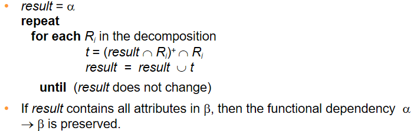

# 13-范式

- 一个好的`schema`的特征：没有冗余数据(其实并不是说没有冗余就一定是最优的)，不需要使用`null`等不确定字符(会导致每条记录的长度不一)

- 关于**键**的相关概念：

  - 超键(`superkey`):即可以唯一的表示一条记录的一些属性组成的集合。但是超键很可能存在属性的冗余。
  - 备选建(`candidate key`):实际上就是去除了冗余的超键。可以有多个。
  - 主键(`primary key`):选取备选建中的一个最为主键，主键中也可以包含多个属性字段。

- `schema`的划分(**`decomposition`**)

  - 是将原来的数据表中的某一些字段分出去生成一张新的表，并在这些字段中选取新的主键。
  - 问题1：信息丢失。即划分之后的两张表格无法在重构(重构:`R`划分为`R1, R2`,则重构的表为`R1 U R2`)为原来的表格。出现信息丢失(`R是R1UR2`的子集)的被称为`lossy decomposition`,未出现信息丢失的被称为`lossless decomposition`.
  - 

- 范式理论：

  - 用于判断一个`schema`是否满足一定的要求。若不符合一定的要求，则将其进行划分分解，使得划分结果中的每一个都满足对应的范式要求。(这里的分解一定得是没有消息损失的类型才行)

  - 几个范式的定义：

    - **第一范式**：指的是数据表中的每一个字段都不可以在分解了
    - **第二范式**：指的是每一张表都要有主键，并且其他非主键字段都完全依赖于主键。
    - **`BC`范式**：指的是所有字段既不是部分依赖于备选建，也不是传递依赖于备选建，而是完全直接的依赖于备选建。
    - **第三范式**：指的是所有非主键字段都要完全依赖于主键字段，并且分主键字段直接不能有函数依赖关系(含义就是说主键字段内部可以存在一部分字段与另外一部分主键字段之间的依赖关系)。第三范式相对于`BC`范式会额外的多引入一些冗余数据，但是这样做在一些场景下可以提升数据读取性能，但是可能会导致进行更新的时候性能下降，并且更加可能出错。并且第三范式的冗余数据也确保了满足第三范式的关系一定具有依赖保留属性。
    - **第四范式**：指的是所有字段既不是部分**多值依赖**于备选建，也不是传递**多值依赖**于备选建，而是直接的完全多值依赖于备选建。

  - **函数依赖**：通俗来讲就是，在`R`中，`α->β`这种依赖只要是合法的，那么只要`α`已经确定，那么`β`就能够唯一确定。同一个`α`可以对应于多个`β`,而反过来不一定。

  - **函数依赖闭包**：给定函数依赖`F`,其对应闭包为`F+`。计算函数依赖闭包的规则：

  - ```
    Reflexive rule: if β∈α, then α->β  
    Augmentation  rule: if α->β, then γα->γβ
    Transitivity rule:  A->B,B->C ==> A->C
    ```
    
  - 计算程序：

  - 

  - 若一个关系满足所有的函数依赖关系，则称这个关系是**合法**的。但是只有部分关系的合法并不能说明整体的表格的合法性。

  - **平凡函数依赖**：指的是一个关系的所有记录实例都满足所有的函数依赖关系。一般而言，对于所有`β`属于`α`的情况，`α->β`都是一个平凡依赖。

  - 将一个关系`R`划分为子关系`R1`,`R2`,若`R1∩R2->R1,R1∩R2->R2`中至少有一个存在于函数依赖对应的闭包中，则称这个分解方式是**没有信息丢失的**。(关注课件上面的例子)

  - **依赖保留**：指的是在一个分解作用于一个关系上之后，在检测这个划分是否是信息丢失的只需要在其中一个子关系上面完成就可以了，而不需要对于所有子关系进行笛卡尔积来判断，这种分解就被称为依赖保留。反之则不是依赖保留的。

  - 依赖保留的检测算法：

  - 

  - 如何将一个非`BCNF`的关系`R`分解成多个`BCNF`子关系？

    ```
  We decompose R into:
    (α U β)
  (R - (β - α))(注意α还是被保留的)
    ```

  - 满足`BCNF`的关系很有可能不在具有关系保留的特性。

  - 属性集合的闭包作用：对于属性集合`R1`,记其闭包为`R1+`。则：`R1`是否为超键<==>`R1+`是否包含关系`R`中所有属性，也可以用于检测函数依赖关系中的某一条是否成立。

  - 无关属性：指的是一个函数依赖关系集合中那些被移除之后也不会影响到整个`F+`的属性。

  - 函数依赖集合的正交覆盖：

- **正则覆盖**：

  - 定义：`F`中的函数依赖应该能推出正则覆盖`Fc`中的所有函数依赖,并且`Fc`也应该能退出`F`中所有函数依赖，并且`Fc`中的每一个函数依赖都不包含无关属性，并且`Fc`中的每一个函数依赖的左面的变量都是唯一的。
  - 例子：
  - 

- 检测`BCNF`的算法：

  

- 对于`BCNF`进行**`lossless decomposition`**的算法：

  

- 在上面的算法中，如果发现存在一个`FD α->β`使得`α->Ri`不存在于`F+`中，说明不满足`BCNF`,这时候将`(α，β)`分离出来，那么这个一定是一个`BCNF`,而剩下的部分不一定，因而需要循环的去分解，一直到所有的`Ri`都是`BCNF`为之。

- `BC`范式与`3NF`的比较：`3NF`总是1存在无损分解，并且其分解结果一定是依赖保留的；`BCNF`总是存在无损分解，但是其分解结果不一定是依赖保留的。

- **多值依赖(`multivalued dependency`)**:简单来说就是一个属性确定之后对应多个不同的属性，但只对应于一个的时候，实际上就是一个函数依赖。`e.g.`:

  ```
  Y->->Z:
  则在所有关系r(R)中，应该同时存在：
  <y1, z1, w1>,<y1, z2, w2>,<y1, z1, w2>,<y1, z2, w1>
  ```

- 多值依赖的性质：`if A->B then A->->B`

- 