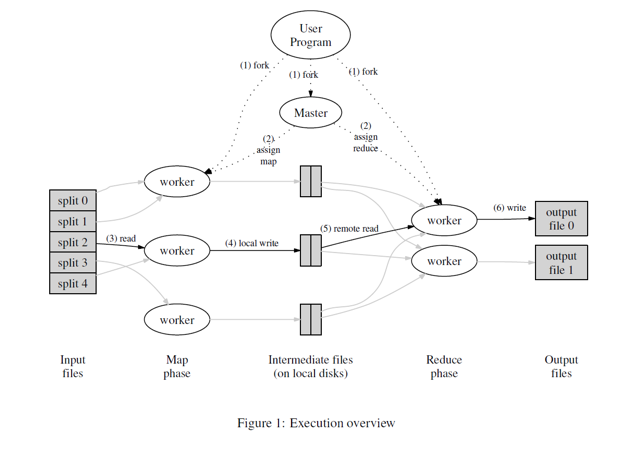

# 24-`Hadoop-MapReduce`

- `Hadoop`核心：**作业调度**(`MapReduce/YARN`)。`Hadoop`包含`HDFS,HBASE,HIVE`等。

- `Hadoop`:可靠的，可拓展的，分布式计算系统。`Hadoop`不完全依赖与系统本身的性能来实现高可用性，也会通过自己的检测系统来发现系统的问题并尝试修复。

- `MapReduce`原理：

  

- 解释：

  - `Input files`:将大文件分成等大小的小块。大小与`HDFS`的文件块大小有关系。过大的话单次需要数据过大，过小的话，`master`进行管理的复杂度会上升。
  - `Map Phase`:每个`MapWorker`处理一个`split`。具体处理那个根据`master`来决定。在工作过程中，`MapWorker`会不断的向`Master`发送心跳，若节点出问题，则将其任务重新调度给其他的节点。`Map`会生成中间结果文件，并写入磁盘。即：`Map:Input Split-->intermediate output`
  - `Reduce Phase`:会处理中间结果文件。对于最终结果进行合并。`Reduce:intermediate outputs-->final outputs`。

- 是一种**批处理**，即数据是一次性输入的，而不是持续不断输入的。

- 注意在生成中间结果的时候**不能直接将结果相加**，因为`reduce`的逻辑是业务相关的，不一定是求和。

- 注意数据需要**可序列化**，因为数据需要进行网络间传输。

- `Combine`:在`map`本地进行一次**局部的**数据整合，之后向后传输，减少数据传输量。

- `Hadoop-MapReduce`的内部执行架构：

  

- `JobTracker`:1.进行资源管理，即跟踪每个节点现在有多少进行任务处理的资源；2.进行任务跟踪，需实时的确定任务执行状态，若出现异常，需要重新分配。

- 每一个`Job`都有一个`TaskTracker`,作用是跟踪检查当前节点的一个`Map/Reduce`任务是否正确结束。

- 如何确定`Mapper`数量：取决于**输入数据**。每个节点可能运行多个`mapper`。

- `Reduce`之前需要进行`shuffle`(分区)+`sort`。

- 如何确定`reducer`的数量：计算公式为：**0.95/1.75** * ` (<no. of nodes> * <no. of maximum containers per node>)`。

  - 0.95：由于需要的`reducer`的数量少于最大容量，那么一定可以立即启动，但是这样的话会使得节点的负载可能比较大。运行时间取决于最长运行时间的那一个。
  - 1.75：由于需要的节点个数大于最大容量，所以一定会出现一个节点做多个`reduce`的情况。这样的好处是每一个`reduce`的工作量小，并且对于那些执行少量任务的节点，能够在结束之后就接收到新的任务，所以负载均衡更好。

- `MapReduce`的问题：**需要大量的硬盘访问**。因为读写中间文件，`shuffle，sort`等操作都需要读取磁盘。

- `MapReduce`的改进版:**`YARN`**:

  - 希望将之前`mapreduce`中的`JonTracker`锁进行的资源管理和任务跟踪分开。并且每一个节点都需要有一个状态追踪管理器，全局有一个资源管理器。

- 