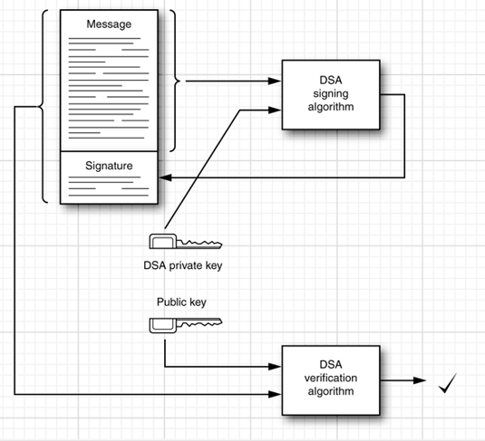
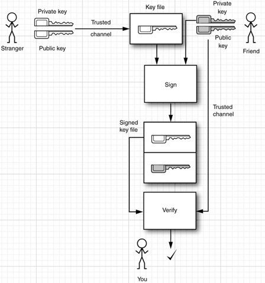
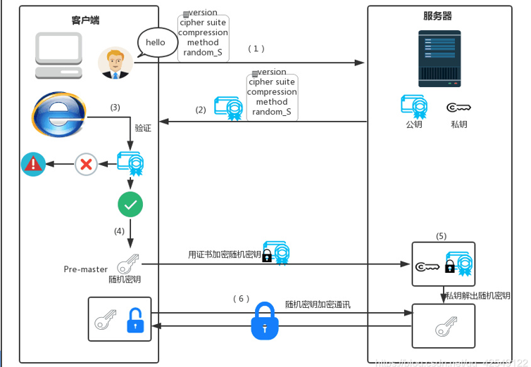

# 7-`security`

- `TIPS`:`Base64`格式指的是对于一个给定的数据，将其二进制表示的每六位转化成一个对应的ASCII码字符。这种编码格式主要适用于处理一些特殊格式文件的传输，如图片，大字符串等。使用这种方式可以保证即使是图片这种不规则的数据仍然可以传输。因为有的网络协议会限制传输时单个字符的字节范围。

- 一般登录请求本身是不需要安全权限的，但是一般安全验证都会需要登陆的时候的信息。在登陆的时候，如果输入信息正确，那么就会生成一个`session`,之后完成认证。这个“认证”只是生成`session`就可以了，只要`session`不过期，那么这次的认证就不会失效。

- 数字签名(`digital signature`)：

  - `digest`(摘要)：根据传输内容中的数据块生成的`fingerprint`。一般通过`SHA1`等算法生成。该算法的特点是，只要数据发生了很微小的变化，最终生成的摘要会发生很大的变化。因为有160位，所以想生成一个完全一样的摘要是几乎不可能的，所以就祛除了数据是被伪造的可能。
  - `digest`的作用：在接收数据的时候，用相同的算法来计算接受的数据获取一个新的摘要，将这个摘要与发送过来的摘要比较，若相同说明没被修改。
  - 而要想保证发送过来的摘要没有被修改，使用**公钥私钥进行加密解密**(即生成一个**数字签名**)。公钥私钥是**成对出现**的，并且两者无关联，即不能通过公钥获取私钥。由于是**非对称加密**，所以公钥加密只有用私钥解密，私钥加密只有公钥可以解密。私钥只有自己可以持有，公钥会通过网络发送给其他人。
  - 结合公钥私钥，那么就可以得出进行发送内容验证的流程：对于一个**即将明文传输**的数据，先对其生成一个`digest`,之后使用**发送者的私钥**对其进行加密得到一个加密之后的摘要，将这个摘要连同要发送的数据一起传输；等到接受者得到这个数据的时候，先使用相同的算法对于接收到的数据生成摘要。**接受者使用发送者的公钥**，来解密一起接受到的加密的摘要。如果不能解密，说明被人篡改过(因为中途如果修改，在发出者的private key未泄露的情况下，**修改者只能获取public key**，而其要么使用public进行对于修改信息的加密(这种会**由于public不能解密public而出错**)要么是用自己的private对于数据进行加密(这种会**由于接收者这部分得public不认识这个private**而报错)，而这两种情况都会失败)，如果能够解密，则能够认证发送者身份，并且通过比较两个摘要就可以确定传输过程中数据是否已经被修改过了。
  - 流程图：

- 如何安全的在网络上传输公钥(即保证传输过程中不会被修改)：

  - 使用**`certificate`**（证书，即加密之后的公钥以及根据公钥得到的加密摘要，与前面格式类似）。

- 如何生成并发放一个证书：

  - 使用`keytool`来管理`keystores`,`keystores`即是用于存储公钥私钥对以及证书的数据库，其中每一项都应该有一个别名。
  - 使用`keytool -genkeypair -keystore(指明存储这个key的数据库) alice.certs -alias alice`来生成一个新的密钥对，别名为Alice。会将回答问题的答案作为种子来生成密钥对。
  - 使用`keytool -exportcert -keystore alice.certs -alias alice -file alice.cer`将别名为Alice的公钥到成为一个加密证书。
  - 接受者可以使用`keytool -printcert -file alice.cer`中输出的`SHA1`等摘要部分来进行内容验证以及发送者身份认证。
  - 若认证成功，则通过`keytool -importcert -keystore bob.certs -alias alice -file alice.cer`将Alice的证书信息导入自己的`keystores--bob.certs`。

- 而在实际使用中，一个用户在判断一个接收到的公钥是否正确，并不是使用上述的方式，而一般是通过**第三方**进行转发。具体流程如下图。这张图说的是获取一个你暂时不信任的用户的public key的可能路径。而这需要一个通过一个你与这个stranger都信任的一个friend用户来实现。首先由于你是信任friend的，所以你拥有这个friend的public key，之后这个friend使用自己的private key对于stranger的public key进行加密，生成一个数字签名，之后在这个签名传递到你这边时，你就可以通过你拥有的friend的public key对于signature进行解密，从而获取之前被加密的stranger的public key，之后如果你信任这个stranger，则可以将其public key加入到`keystore`中去，从而将其变为一个新的”friend”。这张图中的”friend”,一般都是一些第三方的认证公司的产品。

  

- 具体指令集合为:

  ```java
  keytool -genkeypair -keystore acmesoft.certs -alias acmeroot//第三方机构生成自己的公钥私钥 
  keytool -exportcert -keystore acmesoft.certs -alias acmeroot -file acmeroot.cer//第三方机构将自己的公钥导出发给所有信任这个第三方机构的用户，这里为了加密公钥使用了自己的私钥，所以叫做“自签名”
  keytool -importcert -keystore cindy.certs -alias acmeroot -file acmeroot.cer//信任第三方的用户导入这个公钥
  java CertificateSigner -keystore acmesoft.certs -alias acmeroot -infile alice.cer -outfile alice_signedby_acmeroot.cer//第三方用自己的私钥将某个用户要发放的公钥加密并导出证书
  keytool -importcert -keystore cindy.certs -alias alice -file alice_signedby_acmeroot.cer//另外一个信任第三方的用户会用第三方的公钥加密发布的公钥，从而信任之前的用户
  ```

- 加密：

  - **对称加密**。对称加密一般适用于加密**传输的具体的数据**。相对于非对称加密，性能更好。但是由于不区分公钥私钥，即加密解密使用相同的键值，所以发送过程中会出问题。解决方式：**在第一次传输的时候**，对称密钥的产生者用接受者的**公钥**加密一下自己的对称密钥，之后在接受者接收到之后，若能够成功解密，说明这个对称密钥没有被修改。这里强调第一次是说，不希望每次都用公钥加密，那样就变回非对称加密了，性能还是比较差。

- 安全套接字(`SSL`):

  - 指的是双方使用**加密通信（基于非对称加密）**，一端加密，一端解密。
  - 流程图：

- 