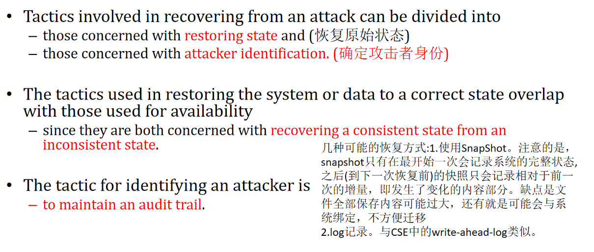

# 8-`security2`

- `JWT:JSON Web Token`。

- 几个概念：

  - `Authentication`:身份认证
  - `Authorization`:授权认证
  - `Audit`:审计

- 同一个公钥私钥对，既可以加密，即用接受者的公钥加密，那么只有接收者能解密；也可以认证自己的身份，即用自己的私钥加密，持有自己公钥的用户都可以解开，这样可以完成身份认证。

- `JWT`三个组成部分：

  - `header`:包含`Base64`(可以消解超过127位的特殊字符不可见/不可读的问题)格式的`token`和`type`。
  - `payload`:包含一些`claims`。即使对于用户信息以及一些额外信息的声明。
  - `signature`:存储的是加密过的`header,playload`信息。需要额外制定一个**`secret`**。

- `JWT`工作原理：首先用户在发送请求之前需要进行**身份认证**，一般是通过登录的方式，再验证成功之后，认证服务器会返回一个`JWT`,**在这个`JWT`过期之前**可以通过将这个`JWT`发送给目标服务器的方式来实现身份认证，从而避免了多次重复认证，即所谓的**单点登录**。

- `Single-Sign-On(SSO)`(单点登录)的优点：

  - 降低了钓鱼网站的钓鱼成功率。
  - 避免了网站过多，用户名密码过多而出现的遗忘。
  - 减少重复输入密码的时间
  - 。。。。

- 单点登录常用协议之一：`Kerberos Protocol`(三头狗协议):

  - 一共包含三方：`client,Authentication server(还会包含一个授权服务器), serverless server(真正要访问的server)`。
  - 用户在认证的时候仍然需要输入用户名和密码，而这个协议**不要求传输密码**，只传输用户名。`client`根据输入的密码通过某一种方式生成一个基于此的密钥`pwd-key1`，之后client只将用户名发给Authentication server。
  - `AS`会使用相同的方式，将根据用户名在数据库中找到的密码进行随机化生成一个新的密钥`pwd-key2`。
  - 之后`AS`会向`client`发送：
    - A:一个使用`pwd-key2`加密的`TGS-Session-key`,这个`key`是用于之后和授权服务器`TGS`通信的。这个消息主要作用是**验证用户输入的内容是否正确**，即如果`pwd-key1`与`pwd-key2`相同，那么应该就可以解密A得到`TGS-Session-key`。
    - B:使用`TGS`的私钥加密的同一个`TGS-Session-key`，这个是client解不开的。
  - 在client处理完上述的消息A，B之后，z在发起请求时，其会向授权服务器`TGS`发送如下消息：
    - C:将消息B中内容与请求的目标服务的ID整合起来得到消息C。
    - D:是使用**从消息A中得到的`TGS-Session-key`**加密的client ID + `timestamp`。
  - 之后`TGS`会接受到消息`c,D`。之后其会先从消息C中获取消息B，之后利用**自己的公钥**解密，从而得到与client交互的那个`TGS-Session-key`。之后用这个`key`来解密消息D。得到了client ID信息。从而就得到了client的信息以及client正在请求的service的编号。如果上述过程成功，那么client与`TGS`都有了对应的`Session key`,所以就相当于建立了连接。之后，**`TGS`**会向**client**发送如下消息：
    - E:是用**目标service的私钥**加密的`client-server-tocket`，其中包含client ID,client `IP`,client与目标service之间将用于通信的`client-service-session-key`。而这个与B消息类似，client端都是不能解密的。
    - F:使用**`TGS-Session-key`**加密的`client-service-session-key`。这个client是可以解密的。
  - 之后client会接受到消息E,F。client会使用自己已经知道的`TGS-Session-key`来解密消息F，从而获得了`client-service-session-key`。之后client则会与**`service server`建立连接**并向其发送如下消息：
    - 消息E不变。
    - G:**使用`client-service-session-key`加密**的client ID+`timestamp`。
  - 之后`service`会接收到消息E,G。service会用**自己的私钥**来解密消息E，得到`client-service-session-key`,之后用这个key来解密消息G，从而得到了client详细信息。之后service server会**向client**发送如下信息：
    - H:使用**`client-service-session-key`**加密的**更新之后的**`timestamp`。一般是直接+1。
  - 之后client会接收到消息H。之后client利用自己已经知道的`client-service-session-key`来解密H，得到了新的时间戳，之后验证时是否被正确的更新。若验证成功，则client会信任这个service，并正式的发送请求。
  - 之后service server向client提供对应的请求，整个流程结束。

- 三头狗协议的缺点：

  - 单点故障。
  - 对于时间戳很敏感。若两个节点之间的物理时间差异比较大，那么会出问题。
  - 容易被攻击而导致信息泄露。

- 一种实现`CAS`:

  - 添加了负载均衡。
  - 添加了磁盘存储以及备份。

- 一个系统的安全性的几个应该具备的特点：

  - 不可否认性：用户做过的操作不会被否认，会有记录。
  - 机密性：没有授权的服务不能被访问。
  - 完整性：发出内容与收到的内容应该一样多且内容已知。如可以添加`checksum`。
  - 确保性：用户只会和能够认证自己身份的server交互，因为如果server不能认证的话，name三头狗协议中的消息A都无法产生，就无法继续。
  - 可用性：合法使用情况下不会使得服务崩溃。
  - 审计特性：能够发现问题并且追溯用户权限。

- 安全策略：

  - 抵御攻击手段。需要满足不可否认性，机密性，完整性以及确保性。

    ```
    Authenticate users.
    Authorize users.
    Maintain data confidentiality. 
    Encryption 
    Communication links
    virtual private network (VPN)
    Secure Sockets Layer (SSL)
    Maintain integrity.
    checksums 
    hash results
    Limit exposure
    Limit access
    Firewalls
    ```

  - 检测攻击手段。通过**入侵检测系统**。(是基于历史经验的，很难监测新型的攻击)

    ```
    some sort of sensor to detect attacks, 
    managers to do sensor fusion, 
    databases for storing events for later analysis, 
    tools for offline reporting and analysis, 
    and a control console so that the analyst can modify intrusion detection actions.
    ```

  - 攻击后恢复。需要恢复到攻击前某一个状态以及检测到攻击者是谁。

    

- 